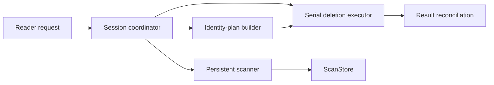

# Background Task System Decision

!!! abstract "Status: Accepted"

    One session coordinator owns scanning, reduction, refresh, and deletion work. A new task type requires its own public design review.

## Problem

Scanning, page lookup, deletion planning, final checks, and deletion can block on the filesystem. The main loop must remain the only writer of application and terminal state so the reader can keep navigating the map.

The diagram names ownership boundaries, not an authorization shortcut: only concrete files and directories can enter deletion planning, and the planner still performs a live no-follow review.

## Decision

The application keeps a fixed-size `DeletionWork` queue separate from `UiMode`. Each retained deletion item has an increasing work ID, a concrete path broken into components, an escaped display label, and one state:

1. awaiting confirmation or queued planning;
2. planning;
3. queued or serial execution; or
4. cancellation acknowledgement, rejection, or completion.

=== "Planner"

    The planner performs a live walk without following links and reviews a directory’s descendants instead of trusting the displayed page. Only one planner builds an identity-bound plan at a time. It may prepare a non-overlapping target while an executor is active, but it cannot change files.

=== "Executor"

    Only one executor performs final checks and filesystem changes. It rechecks and changes files in one operation, so no queue handoff opens a gap between a successful check and the first change.

=== "Reader and scanner"

    Confirmation stays in the foreground before planning begins. After confirmation, the reader returns immediately to ordinary map navigation while the planner and serial executor perform their final checks and work in the background.

    The primary scanner walks breadth first. The coordinator owns work keys, task ownership records, focus, and final status. Its on-disk journal contains only scanner data with fixed limits. Opening or leaving folders reads stored pages of direct children; it never starts a separate scan for each folder or reorders recorded facts. A published scan invalidated by change schedules a versioned refresh. Until that refresh completes, the application never combines the earlier exact map with new live data.

The shared-allocation summary is the only virtual entry and cannot be selected.

## Bounds and Target Conflicts

| Boundary | Rule |
|---|---|
| Retained deletion work | `MAX_DELETION_WORK_ITEMS` caps active work, confirmations, and planner-cancellation reservations. |
| Queues | Planner, executor, scanner-rebuild, and event channels have fixed capacities. A rejected submission restores its item instead of dropping it. |
| Overlap | A new item is rejected when its path is the same as, contains, or is within a retained target. Ancestor, descendant, and duplicate operations cannot race. |
| Cancellation | A running planner keeps its reservation until it acknowledges cancellation. A generation rebuild keeps its scan-store session boundary until it publishes or is cancelled. |
| Reporting | Deletion history has a byte limit and fixed report-count cap. Summaries keep fixed-size counters and one atomic progress value. Reports stream from limited memory or authenticated temporary storage. |

## Exit and Reconciliation

???+ warning "No detached mutation worker"

    The exit dialog distinguishes no work, cancellable pending work, and active deletion. Pending work can be cancelled before quitting or left running while the reader returns to the map. Active deletion can stop only at an entry boundary or be awaited. No key silently detaches a mutation worker.

A completed report either invalidates or republishes the current ScanStore result. A complete target removal creates an immutable overlay without that path. A partial or uncertain result discards the active view and schedules a newer root scan. The board then selects a surviving actionable entry, clears an empty view, or restores the nearest valid folder.

## Consequences

The visible work panel exposes bounded activity and progress without copying plans or reports into frame state. The foreground dialog remains limited to an irreversible consent decision, and report formats retain their existing precise or uncertain meanings.

!!! note "Review boundary"

    Changes to target-overlap rules, queue capacities, serial mutation, no-follow validation, report retention, or exit behavior require public architecture review.
