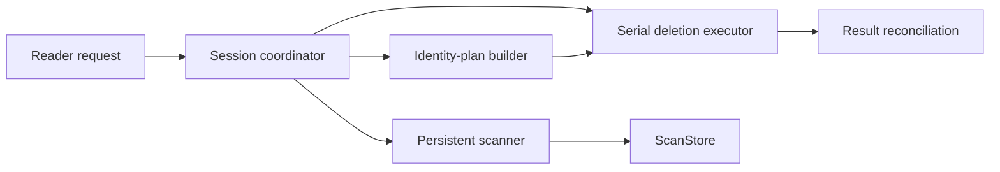

# Background Task System Decision

!!! abstract "Status: Accepted"

    One session coordinator owns scanning, reduction, refresh, and deletion work. A new task type requires its own public design review.

## Problem

Scanning, page lookup, deletion planning, final checks, and deletion can block on the filesystem. The main loop must remain the only writer of application and terminal state so the reader can keep navigating the map.

```mermaid
flowchart LR
    Request[Reader request] --> Coordinator[Session coordinator]
    Coordinator --> Scanner[Persistent scanner]
    Coordinator --> Planner[Identity-plan builder]
    Coordinator --> Executor[Serial deletion executor]
    Scanner --> Store[ScanStore]
    Planner --> Executor
    Executor --> Reconcile[Result reconciliation]
```

The diagram names ownership boundaries, not an authorization shortcut: only concrete files and directories can enter deletion planning, and the planner still performs a live no-follow review.

## Decision

The application keeps a fixed-size `DeletionWork` queue separate from `UiMode`. Each retained deletion item has an increasing work ID, a concrete path broken into components, an escaped display label, and one state:

1. awaiting confirmation or queued planning;
2. planning;
3. queued or serial execution; or
4. cancellation acknowledgement, rejection, or completion.

=== "Planner"

    The planner performs a live walk without following links and reviews a directory’s descendants instead of trusting the displayed page. Only one planner builds an identity-bound plan at a time. It may prepare a non-overlapping target while an executor is active, but it cannot change files.

=== "Executor"

    Only one executor performs final checks and filesystem changes. It rechecks and changes files in one operation, so no queue handoff opens a gap between a successful check and the first change.

=== "Reader and scanner"

    Confirmation stays in the foreground before planning begins. After confirmation, the reader returns immediately to ordinary map navigation while the planner and serial executor perform their final checks and work in the background.

    The primary scanner walks breadth first. The coordinator owns work keys, task ownership records, focus, and final status. Its on-disk journal contains only scanner data with fixed limits. Opening or leaving folders reads stored pages of direct children; it never starts a separate scan for each folder or reorders recorded facts. A published scan invalidated by change schedules a versioned refresh. Until that refresh completes, the application never combines the earlier exact map with new live data.

The shared-allocation summary is the only virtual entry and cannot be selected.

## Bounds and Target Conflicts

| Boundary | Rule |
|---|---|
| Retained deletion work | `MAX_DELETION_WORK_ITEMS` caps active work, confirmations, and planner-cancellation reservations. |
| Queues | Planner, executor, scanner-rebuild, and event channels have fixed capacities. A rejected submission restores its item instead of dropping it. |
| Overlap | A new item is rejected when its path is the same as, contains, or is within a retained target. Ancestor, descendant, and duplicate operations cannot race. |
| Cancellation | A running planner keeps its reservation until it acknowledges cancellation. A generation rebuild keeps its scan-store session boundary until it publishes or is cancelled. |
| Reporting | Deletion history has a byte limit and fixed report-count cap. Summaries keep fixed-size counters and one atomic progress value. Reports stream from limited memory or authenticated temporary storage. |

## Exit and Reconciliation

???+ warning "No detached mutation worker"

    The exit dialog distinguishes no work, cancellable pending work, and active deletion. Pending work can be cancelled before quitting or left running while the reader returns to the map. Active deletion can stop only at an entry boundary or be awaited. No key silently detaches a mutation worker.

A completed report either invalidates or republishes the current ScanStore result. A complete target removal creates an immutable overlay without that path. A partial or uncertain result discards the active view and schedules a newer root scan. The board then keeps the selected entry if it survived. If it did not, the board selects the largest surviving actionable entry only while the reader has not yet moved the cursor; after the first move it clears the selection until the next one, so a deletion never moves the cursor onto an entry the reader did not choose. An empty view is cleared, and a removed folder view restores the nearest valid folder.

## Consequences

The visible work panel exposes bounded activity and progress without copying plans or reports into frame state. The foreground dialog remains limited to an irreversible consent decision, and report formats retain their existing precise or uncertain meanings.

!!! note "Review boundary"

    Changes to target-overlap rules, queue capacities, serial mutation, no-follow validation, report retention, or exit behavior require public architecture review.

## Terminal Output Writer

!!! abstract "Status: Accepted"

    A dedicated writer thread transmits already-rendered frame and terminal-session bytes so a slow terminal cannot block the owner loop. It is not a session-coordinator task type: it carries no work items and makes no scanning, deletion, or rendering decisions.

`ratatui::Terminal::draw` queues a frame's commands into the backend's writer, then flushes; the terminal was the blocking point between that flush and the OS accepting it. When the real terminal reads output slower than excise produces it, the flush call blocks until the terminal catches up, blocking the owner loop and, with it, every input and scan batch it has not yet processed.

The owner loop renders into an `io::Write` handle that only buffers in memory, then hands one flush's bytes to a single dedicated writer thread as one ordered message. That thread performs the real, potentially slow, write and flush; it owns no other state and makes no other decision. The owner loop renders a new frame only once the thread confirms the previous one has drained (coalescing: the next frame it does render reflects however much changed while it waited, not a queued backlog of stale ones), so it is never more than one frame's bytes behind the terminal.

Terminal-session entry and restoration (leave the alternate screen, show the cursor, disable mouse capture, restore line wrap) go through the same thread and the same ordered channel as frames, so restoration always follows every frame byte and is never interleaved with or reordered ahead of them, including when the program exits while a frame is still draining. Restoration then waits for the thread to confirm it drained, bounded, so a terminal that never reads anything cannot hang exit; raw mode is still disabled either way.

Two situations cannot use that ordered path, because nothing is left able to drain it: the writer thread itself panicking (the global panic hook then runs on that same thread, which would otherwise wait on a queue only it could ever service) and the writer thread having already stopped entirely (an earlier panic already unwound it). Both are detected directly (by thread identity, and by the channel send failing) rather than by waiting out the bound, and restoration writes straight to the terminal instead.

=== "Alternatives considered"

    - **Non-blocking writes polled alongside input.** Making the terminal's descriptor non-blocking and folding its readiness into the owner loop's existing poll would keep every write on the owner loop, satisfying the single-writer rule most literally. Rejected: Windows ConPTY's anonymous output pipe has no supported non-blocking write mode, so the same mechanism could not work on both platforms excise supports without a separate, harder-to-verify Windows path.
    - **Buffer every frame and let the writer thread catch up in its own time.** Simpler (no gate), but a terminal slower than excise's production rate would accumulate an unbounded backlog of stale frames that the writer thread would still be draining well into what should be an idle, silent period, violating the idle-output budget and bounding neither memory nor how far behind the terminal the display can fall.
    - **Drop a produced frame instead of coalescing before producing it.** Skipping delivery of a frame already handed to a writer would let the terminal's displayed state silently diverge from what Ratatui's diff believes it last drew, corrupting every later incremental update. Deciding not to render is free; discarding a frame already committed to is not.

!!! note "Review boundary"

    Changes to this thread's buffering, ordering, or restoration-wait behavior require the same public architecture review as a session-coordinator task type.

