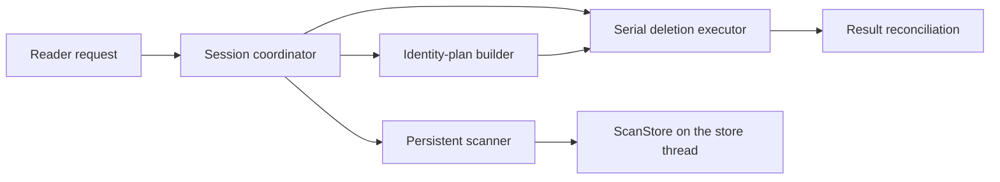

# Background Task System Decision

!!! abstract "Status: Accepted"

    One session coordinator owns scanning, reduction, refresh, and deletion work. A new task type requires its own public design review; "Task Types" below defines the term. A thread that is not a task type, such as the scan-store thread, goes through the same review when what it owns, how its queues are bounded, the order it acts in, or how it stops changes.

## Problem

Scanning, merging and publishing scan data, page lookup, deletion planning, final checks, and deletion can block on the filesystem. The main loop must remain the only writer of application and terminal state so the reader can keep navigating the map.

```mermaid
flowchart LR
    Request[Reader request] --> Coordinator[Session coordinator]
    Coordinator --> Scanner[Persistent scanner]
    Coordinator --> Planner[Identity-plan builder]
    Coordinator --> Executor[Serial deletion executor]
    Scanner --> Store[ScanStore on the store thread]
    Planner --> Executor
    Executor --> Reconcile[Result reconciliation]
```

The diagram names ownership boundaries, not an authorization shortcut: only concrete files and directories can enter deletion planning, and the planner still performs a live no-follow review.

## Decision

The application keeps a fixed-size `DeletionWork` queue separate from `UiMode`. Each retained deletion item has an increasing work ID, a concrete path broken into components, an escaped display label, and one state:

1. awaiting confirmation or queued planning;
2. planning;
3. queued or serial execution; or
4. cancellation acknowledgement, rejection, or completion.

=== "Planner"

    The planner performs a live walk without following links and reviews a directory’s descendants instead of trusting the displayed page. Only one planner builds an identity-bound plan at a time. It may prepare a non-overlapping target while an executor is active, but it cannot change files.

=== "Executor"

    Only one executor performs final checks and filesystem changes. It rechecks and changes files in one operation, so no queue handoff opens a gap between a successful check and the first change.

=== "Reader and scanner"

    Confirmation stays in the foreground before planning begins. After confirmation, the reader returns immediately to ordinary map navigation while the planner and serial executor perform their final checks and work in the background.

    The primary scanner walks breadth first. The coordinator owns work keys, task ownership records, focus, and final status. Its on-disk journal contains only scanner data with fixed limits. Opening or leaving folders reads stored pages of direct children; it never starts a separate scan for each folder or reorders recorded facts. A published scan invalidated by change schedules a versioned refresh. Until that refresh completes, the application never combines the earlier exact map with new live data.

The shared-allocation summary is the only virtual entry and cannot be selected.

## Task Types

A **task type** is a kind of work that the session coordinator schedules: one `WorkKind` in the code, and the scheduler accepts no untyped job. Work of a task type is created by a request to the coordinator; identified by a work key (session, scan generation, kind, and path) that deduplicates it; ordered by a priority class; run by exactly one worker that holds a lease the coordinator issues, and that a newer generation or an invalidation voids; and ended by a final status the coordinator records. Its result reaches the main loop as an event, and only the main loop decides what the result changes.

There are five: directory enumeration, run reduction, subtree refresh, deletion planning, and deletion execution. Adding one, or widening what a type's lease permits, requires its own public design review.

A thread that has none of those marks is not a task type: it holds no work key, no lease, and no status, and it decides nothing. It applies a decision the main loop already made to storage or a stream the thread owns, and reports back. The terminal writer, the scan-store thread, and the deletion-history export, each described below, are such threads, and so is the signal listener. Moving where an existing task type's work runs, behind the same key, lease, and status, adds no task type either: publishing a scan is the reduction task type's work, and it still runs under the reduction's lease, now on the scan-store thread. What such a thread needs is review of what it owns: a change to its ownership, to the capacity or order of its queues, or to how it stops requires the same public architecture review as a new task type.

## Bounds and Target Conflicts

| Boundary | Rule |
|---|---|
| Retained deletion work | `MAX_DELETION_WORK_ITEMS` caps active work, confirmations, and planner-cancellation reservations. |
| Queues | Planner, executor, scanner-rebuild, and event channels have fixed capacities. A rejected submission restores its item instead of dropping it. |
| Overlap | A new item is rejected when its path is the same as, contains, or is within a retained target. Ancestor, descendant, and duplicate operations cannot race. |
| Cancellation | A running planner keeps its reservation until it acknowledges cancellation. A generation rebuild keeps its scan-store session boundary until it publishes or is cancelled. |
| Store thread | The owner-to-store and store-to-owner queues have fixed capacities (`STORE_COMMAND_CAPACITY`, `STORE_RESULT_CAPACITY`) that follow the in-flight batch cap, not the tree. The main loop takes no further scanner event while the command queue is nearly full. A sealed batch holds one in-flight credit from the scanner's seal until the batch is dropped, whichever path ends it. |
| Reporting | Deletion history has a byte limit and fixed report-count cap. Summaries keep fixed-size counters and one atomic progress value. Reports stream from limited memory or authenticated temporary storage. |

## Exit and Reconciliation

???+ warning "No detached mutation worker"

    The exit dialog distinguishes no work, cancellable pending work, and active deletion. Pending work can be cancelled before quitting or left running while the reader returns to the map. Active deletion can stop only at an entry boundary or be awaited. No key silently detaches a mutation worker.

A completed report either invalidates or republishes the current ScanStore result. A complete target removal has the store thread build and publish an immutable overlay without that path: it copies the map the reader has installed, and records the folder that held the target as the file system has it now, because the removal moved that folder's modification time, and its link count when the target was a folder (or a file, on APFS, which counts a folder's files in its link count). The map the reader has stays installed until the overlay arrives, and the main loop then swaps it in; the screen does not wait for it, and leaves the removed target out from the moment the deletion ends (below). A removal the map cannot describe exactly schedules a newer root scan instead of an overlay: a file that has, or may have, other hard links, each of which now has one fewer (the map has its files by path and cannot say where the others are; the executor counts the links left once its own name is gone, through a reference it holds to the file across its removal on Linux, through a lookup of the file's identity on macOS that opens nothing, and through the handle that removes it on Windows, so a link the file gained since the scan counts too, and so does a file it could not count or reference (on macOS, one the system cannot look up by its identity), one that was already gone when it reached it, and one whose removal was followed by a failure (the cleanup of its placeholder)); a folder that is not the one the scan recorded; and a folder that holds other entries than the map lists for it. The folder's modification time describes every change to its entries, not only the removal, so a map that recorded it after another process had made, removed, renamed, or replaced an entry beside the removed one would let the folder be deleted with entries in it that the map never showed. The store thread therefore lists the folder, one stat for each entry through the folder's own handle, and compares a digest of the names, kinds, and identities it finds with the digest it accumulates from the map's entries of the folder less the removed one, keeping neither list. The listing leaves out the files Excise itself holds open in that folder, by exact path and without reading them, as the scanner does: on Windows, the spill of a large deletion's report, which stays beside the removed folder for as long as the history keeps the report and is held open with no sharing. A partial or uncertain result discards the active view and schedules a newer root scan. The board then keeps the selected entry if it survived. If it did not, the board selects the largest surviving actionable entry only while the reader has not yet moved the cursor; after the first move it clears the selection until the next one, so a deletion never moves the cursor onto an entry the reader did not choose. An empty view is cleared, and a removed folder view restores the nearest valid folder.

A deletion that finishes before the first map is published is the exception: it neither invalidates nor republishes anything yet. The scan and the live view the reader navigates stay as they are. The scan went on through the deletion, so the map it ends with mixes what the file system held before the deletion and after it, and the live view and that map list the removed entry until the map is made to agree with the deletion, though the screen leaves it out from the moment the deletion ends. A removal that the overlay above can describe is recorded (up to eight; the list is bounded) and taken out of the first map once it is shown: the store thread builds one overlay for each, one after the other, in the order the deletions finished, and each derives from the map the one before it installed, so the next is asked for only when the previous has arrived, and nothing starts, no deletion and no rebuild, between two of them. The refresh lands once, behind the last. An overlay checks the folder that held its entry against the map (for a removal recorded before the first map, directly below the scan root too, listing the root without replacing its recorded snapshot, because the root has no record of its own to compare with and the scan was still reading when the deletion ran; an overlay after the first map does not list the root), and the removals still owed an overlay are already gone from that folder, so the check is against the map less this removal and every removal after it; several entries removed from one folder are therefore described one after the other. A removal the overlay cannot describe (a partial one, one that may have left other links to a file, one past the limit), and an overlay that fails, send the map back to a scan as they do after the first map, and the removals still owed are dropped, because that scan finds them made. If the first map cannot be published, the recorded removals are dropped and nothing starts. A failure excused below the target of a deletion that is still executing is owed that deletion's removal: if it ends in any way but a complete removal the overlay can describe (restored, partial, rejected, cancelled), the map is rebuilt. The header reads `SCANNING` until the first map is shown. A path the scan finds gone because a deletion removed it (a directory it cannot open or list, or an entry it cannot stat, or one whose parent is a file or was reported replaced, as it is while the executor holds a name under a placeholder) is no failure: from the moment a deletion's work is handed to the executor, and for the deletions that finished, a path that vanishes under the scanner below the deletion's target counts for nothing (for the eight deletions the list holds; a failure below a ninth is a real one once that deletion has finished), so the map shows no `READ ERROR` for it and the run does not end in the code of an uncertain scan. A directory gone from anywhere else is a failure, as it always was. The names the executor itself makes in the tree on Linux and macOS while it isolates an entry (the placeholder, the name that holds the entry until it is removed, and a fresh one for the placeholder's last move) are registered by their exact path, before they exist, as private files of the session, so the scan and an overlay's listing skip them while they are registered and neither records one as the user's entry. The registration ends when the entry's outcome is known, and one interleaving remains: a scan worker that took one of these names from a listing before then, and reaches it only after, fails to stat a name that is gone. That name is a sibling of the target and not below it, so the failure is counted as unreadable (`READ ERROR`, exit code 2), which errs towards reporting less certainty and not more. Windows removes an entry through an open handle and makes no such name.

**What the screen shows while the map catches up.** The overlay is a pass over every entry of the map, so it takes seconds for a million entries, and longer for more, and a rebuild takes as long as a scan. The screen does not wait for either. The main loop keeps the target of every deletion that removed it whole, from the moment the deletion ends until the refresh it owes lands (at most thirty-two; the list is bounded), and the board's listing of the folder on screen leaves each of them, and everything below it, out of whatever page it shows: the live view of a scan, the map the reader has installed, or the stale map that stays up while a rebuild is owed. A removal the reader confirmed is therefore off the screen when its deletion ends, and stays off it when the reader leaves the folder and comes back. A later page of a long folder that a removal leaves without an entry is not shown as an empty folder: the reader is taken back to the page before it. A cursor the reader placed on a removed entry clears with it, and stays clear through every refresh that follows (a page of the scan, the first map, the map that replaces it, even when that map drops the filter the reader applied, a resize) and through paging, until they move or click again, open another folder, apply another filter, or zoom: no refresh arms another. The refresh lands, and the list empties, when no overlay, rebuild, or recorded removal is owed any more, and the board is built again from the page on screen, because a rebuild lists an entry created again at a removed path, which the view left out until then. If the store is lost instead, no map follows and the page on screen still lists the entry, so the list stays and the screen goes on leaving the entry out. Until the refresh lands everything else a page says is what the map says, the sizes of the folders above a removed target and the totals in the header included. A partial removal hides nothing, because part of its target is still there. When the map that lands lists the same entries as the screen already shows, under ids of its own, the board takes the new ids in place and nothing moves.

The end of a scan the reader watched fill in also settles the cursor: the board puts one the reader has not moved or clicked on the largest actionable entry of the folder on screen, once, and leaves one the reader placed where it is. That is the first scan's end, and the end of a rescan that had no map to keep on screen. A rescan behind the map the reader kept is a refresh of that map, and its cursor follows the rule above.

## Consequences

The visible work panel exposes bounded activity and progress without copying plans or reports into frame state. The foreground dialog remains limited to an irreversible consent decision, and report formats retain their existing precise or uncertain meanings.

!!! note "Review boundary"

    Changes to target-overlap rules, queue capacities, serial mutation, no-follow validation, report retention, or exit behavior require public architecture review.

## Terminal Output Writer

!!! abstract "Status: Accepted"

    A dedicated writer thread transmits already-rendered frame and terminal-session bytes so a slow terminal cannot block the owner loop. It is not a session-coordinator task type: it carries no work items and makes no scanning, deletion, or rendering decisions.

`ratatui::Terminal::draw` queues a frame's commands into the backend's writer, then flushes; the terminal was the blocking point between that flush and the OS accepting it. When the real terminal reads output slower than excise produces it, the flush call blocks until the terminal catches up, blocking the owner loop and, with it, every input and scan batch it has not yet processed.

The owner loop renders into an `io::Write` handle that only buffers in memory, then hands one flush's bytes to a single dedicated writer thread as one ordered message. That thread performs the real, potentially slow, write and flush; it owns no other state and makes no other decision. The owner loop renders a new frame only once the thread confirms the previous one has drained (coalescing: the next frame it does render reflects however much changed while it waited, not a queued backlog of stale ones), so it is never more than one frame's bytes behind the terminal.

Terminal-session entry and restoration (leave the alternate screen, show the cursor, disable mouse capture, restore line wrap) go through the same thread and the same ordered channel as frames, so restoration always follows every frame byte and is never interleaved with or reordered ahead of them, including when the program exits while a frame is still draining. Restoration then waits for the thread to confirm it drained, bounded, so a terminal that never reads anything cannot hang exit; raw mode is still disabled either way.

Two situations cannot use that ordered path, because nothing is left able to drain it: the writer thread itself panicking (the global panic hook then runs on that same thread, which would otherwise wait on a queue only it could ever service) and the writer thread having already stopped entirely (an earlier panic already unwound it). Both are detected directly (by thread identity, and by the channel send failing) rather than by waiting out the bound, and restoration writes straight to the terminal instead.

=== "Alternatives considered"

    - **Non-blocking writes polled alongside input.** Making the terminal's descriptor non-blocking and folding its readiness into the owner loop's existing poll would keep every write on the owner loop, satisfying the single-writer rule most literally. Rejected: Windows ConPTY's anonymous output pipe has no supported non-blocking write mode, so the same mechanism could not work on both platforms excise supports without a separate, harder-to-verify Windows path.
    - **Buffer every frame and let the writer thread catch up in its own time.** Simpler (no gate), but a terminal slower than excise's production rate would accumulate an unbounded backlog of stale frames that the writer thread would still be draining well into what should be an idle, silent period, violating the idle-output budget and bounding neither memory nor how far behind the terminal the display can fall.
    - **Drop a produced frame instead of coalescing before producing it.** Skipping delivery of a frame already handed to a writer would let the terminal's displayed state silently diverge from what Ratatui's diff believes it last drew, corrupting every later incremental update. Deciding not to render is free; discarding a frame already committed to is not.

!!! note "Review boundary"

    Changes to this thread's buffering, ordering, or restoration-wait behavior require the same public architecture review as a session-coordinator task type.

## Scan Store Thread

!!! abstract "Status: Accepted"

    A dedicated `excise-scan-store` thread owns the write side of the session's `ScanStore`: admitting the scanner's sealed batches, merging runs, and publishing a finished scan or a deletion overlay. It is not a session-coordinator task type: it holds no work key, lease, or status, and it decides no application state. It applies commands the main loop sends, in the order sent, and reports what happened. Reading a published generation stays on the main loop.

Admitting a batch, merging runs, and publishing a scan are blocking file I/O whose cost grows with the scan: one merge, or the publication of a large scan, takes longer than the interface may go without drawing a frame. Run on the main loop, they stalled it, and every key and frame waited behind them.

**Ownership.** The main loop decides; the store thread applies. Each command is a decision the main loop made: admit this batch, publish the scan, begin a generation, publish a deletion overlay, discard or cancel the active generation, build the live view of a folder. The thread changes the store and reports the outcome; it never reads or writes application or terminal state. The reduction lease for publishing the primary scan stays with the main loop, which finishes it when the publication ends.

**A published generation is a value that changes hands.** The thread builds it and sends it; the main loop swaps it in and reads its pages synchronously from then on, so navigating a finished scan still has no loading view. The thread keeps nothing of it. A deletion overlay is built from the generation the main loop has installed, which the command describes by its files and the main loop keeps until the overlay arrives, so those files outlive every read of them, and a generation the main loop dropped unseen, such as a rebuild cancelled while its map was being published, is never what a later overlay derives from. The one thing the thread reads of the file system is the folder that held the removed target, through the handles of the folders above it: its own metadata, to record what the removal made of it, and a listing of its entries, to record that only when the folder holds the entries the map lists for it. It writes nothing there.

**The live view of a scan in progress belongs to the thread**, because it is built from the generation the thread is writing. The main loop asks for a folder's view and applies the page when it arrives; one request is outstanding at a time. A drill that opens such a page waits for it, behind the batches already queued and any merge under way, which used to stall the whole interface; a drill while the finished scan's map is being published waits for that map. The map keeps drawing and taking input meanwhile, showing what it had.

**Bounds.**

- Both queues are bounded by named constants. `STORE_COMMAND_CAPACITY` is two commands for each in-flight batch (the batch, and the coalesced notes sent ahead of it) plus a fixed reserve for control commands; `STORE_RESULT_CAPACITY` covers the few results that can be outstanding. Neither follows the tree.
- The main loop never waits on the thread. It sends without blocking; a control command that finds the command queue full ends the generation as failed, which the reserve exists to make unreachable. The thread, handing a result to a full queue, waits and notices a stop.
- The main loop takes the scanner's next event only while the command queue has room for another batch. A store thread that falls behind backs the scanner up through its bounded event channel and the in-flight cap instead of growing a queue.
- A sealed batch holds one in-flight credit from the scanner's seal until the batch is dropped: after admission, or by a stale lease, an unavailable store, a closed channel, or a cancelled scan. The batch's destructor returns the credit, so no path has a release to forget, and the scanner's bounded wait for a credit remains the backstop. The headless scan admits on the thread that receives each batch, and takes its credit back as the batch arrives.
- How far a publication has got is one atomic counter that the thread writes and the main loop reads for the status line. It cannot make either side wait or grow anything. One stage can run for longer than the screen may stand still, and a frame is drawn only when something on screen changes, so the status line also shows how long the map has been finishing, which the main loop reads from its own clock every tenth of a second: while the thread works through a long stage the screen keeps moving, which shows the loop is free to take a key.
- What an overlay reads of the user's tree is one folder, and its cost follows that folder, never the tree. The thread lists the folder that held the removed target with one stat for each entry through the folder's own handle, and keeps a digest of what it finds, not the list, so the memory it uses does not grow with the folder; it checks whether the session was stopped at every entry, so a shutdown does not wait out a long folder. It skips, by exact path and without reading them, the files Excise holds open in the tree (the session registers each, and the scanner leaves them out too): a name's shape proves nothing about who made the file.

**What waits for a map.** Until a publication's generation arrives, the main loop still holds the map before it, and treats that map as behind the filesystem. No deletion starts while a finished scan's map is being published, and the next queued deletion waits for the overlay of the one before it, because the next overlay derives from that one. A deletion that finishes while a rebuild's map is being published invalidates the map instead of building on a map that is about to be replaced; one that finishes while an overlay is being built waits its turn behind it, and the overlays are asked for one after the other. One that finishes before the first map is installed, whether the scan is still running or its map is being published, leaves the scan and the reader's live view alone: no map exists yet for an overlay to derive from, and the scan went on through the deletion, so it is recorded, and the overlays that take the recorded removals out of the first map are asked for one after the other once the reader has it (a removal that cannot be described gets a rebuild behind the first map instead). Queued work waits and is not cancelled, through the whole chain of overlays. A scan export waits for the overlay too, since the earlier map still lists what the deletion removed. Esc on a rebuild holds through its publication: the generation the thread builds afterwards is dropped, the stale map stays, and the rebuild ends as cancelled. A confirmed quit that waited for a rebuild finishes when the rebuild's map arrives or is dropped. If the thread is lost while a map is being built, the map on screen is withdrawn as unavailable, not left standing as the current map.

**Stopping.** The store thread stops before anything removes the session's storage. Shutdown stops the session's storage quota, which makes the thread's next block of I/O fail, and the one pass that reads no run, the metric-ordered index, checks the quota once per batch of records. A merge or publication sized by the whole scan therefore ends within one block or batch; shutdown then drops both queues and joins the thread. The session directory is removed only when the last holder of the session's storage lets go, and the thread's store is one holder until the thread ends, so the directory outlives every write to it. A confirmed quit, from a key or a signal, waits for one block of I/O and not for the publication. A second signal bounds the waits of that shutdown for the store thread, the scanner, the deletion planner, and an export, and does not bound the wait for the deletion executor. A thread inside a call that a hung file system never answers cannot be stopped from outside, so after the second signal each wait it bounds gives the threads still running one second to end and then leaves them to the exit of the process; the terminal is restored all the same, by the main loop, which is the thread that waited. A thread left behind still holds the session's storage, so the next start's sweep removes the directory. The executor is always waited for: an entry is moved aside before it is removed, so a process that ended inside one could leave a target that is neither intact nor gone, and a second signal is not worth that. A deletion stuck in a call that never returns therefore still holds a forced exit, as it always has, and the second signal's one second does not run while the executor is waited for.

=== "Alternatives considered"

    - **Slice the work on the main loop.** Admission, the merges, and the page-index build are single passes over runs sized by the scan. Making each one resumable and spending a bounded slice of it per loop pass would keep every write on the main loop, but the work would stay serial with drawing and input, and every pass would need rewriting as a state machine. The thread boundary gives the same bound without changing the passes.
    - **Share the store behind a lock.** The main loop would then wait on the lock for as long as a merge held it, the same stall under another name, and every store method would need a lock-order argument.
    - **Read published pages on the thread too.** Every folder opening would then wait on a queue, which is the loading view the map has never had. None of the latency scenarios showed a read of a published page over budget.
    - **An unbounded or blocking command queue.** The first lets the tree set the queue's size; the second hands the stall back to the main loop.

!!! note "Review boundary"

    Changes to the store thread's commands, to the capacity or order of its queues, to what an in-flight credit covers, to which side reads which generation, to what the thread reads of the user's tree, or to how the thread stops require the same public architecture review as a session-coordinator task type.

## Deletion-History Export

!!! abstract "Status: Accepted"

    Shift+E serializes the deletion history on a transient `excise-history-export` thread. Like the scan-store thread it is not a task type: the main loop decides that an export happens and what it covers, and the thread only writes the file.

After a large deletion the history holds a report for each entry removed, up to its byte limit, and writing that out as JSON takes longer than the interface may go without a frame. The main loop hands the thread a snapshot of the history, a reference-counted handle to each report (a few pointers, however long the history is), and carries on drawing and taking input. The thread writes to the next free file in the working directory and sends one outcome through a queue of one slot, which the main loop polls; a notice then names the file, or reports why none was written.

- One export runs at a time. A second Shift+E while one runs reports that an export is in progress instead of queueing another.
- When the file is complete the main loop drops from its history exactly the reports the export covered and keeps any that finished meanwhile. A failed export keeps the whole history.
- The history keeps a place for the report of every deletion allowed to start. It counts the deletions still running together with the reports it holds, and each plan may use half of the bytes the history has left after the plans already running, so the reports an export is still writing cannot crowd out one that finishes meanwhile: none is lost from the file or from memory. A report is charged for what its plan held in memory, which the plan's budget bounds: a plan that outgrows its budget spills its entries to temporary storage, holds none in memory from then on, and is charged nothing, so the report of a large folder fits the place kept for it and is not dropped once the folder is gone. It stays in temporary storage until an export or a restart drops it. While the count or the bytes leave no room, Excise says the history is full instead of starting another deletion, until an export or a restart frees it.
- Leaving the program cancels an export in progress: its next write fails, the thread removes the partial file, and shutdown joins it. A second signal does not wait for a write that never returns: after the grace it leaves the thread, and the partial file, to the exit of the process.

!!! note "Review boundary"

    Changes to what the export reads, how many may run at once, or how it stops require the same public architecture review as a session-coordinator task type.
