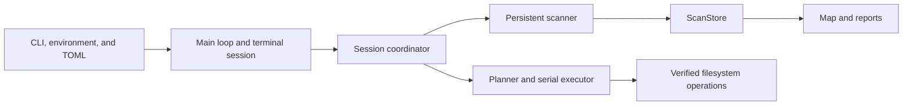

# Architecture

!!! abstract "Ownership rule"

    One main loop owns application state, terminal state, layout, rendering, and visual effects. Persistent scanner, deletion-planner, and serial deletion-executor workers perform blocking filesystem work in the background through typed queues with fixed limits.

Visual effects run only after the interface prepares its content. They never own product state or decide whether an operation is safe.

## Components

### Command Line and Configuration

Excise validates command-line options, environment variables, and the TOML configuration file before starting the terminal interface. Precedence is command line, environment, versioned file, then defaults. Unknown keys and invalid limits are rejected. Table and JSON reports work without a terminal.

### Terminal Session

A terminal-session guard owns raw input mode, the separate screen, cursor visibility, colors, and optional mouse capture. It restores the terminal after normal return, a typed error, a panic, or a boundary-safe cancellation.

### Main Loop

The main loop polls terminal input with a short maximum wait. It renders each folder opening before returning to queued scanning and applies at most one stored scan batch before checking input again. When the map is moving, a fixed-size channel slows scanner updates. The interface redraws when state changes, apart from deletion progress and visual effects. Effects run at most 30 times per second; overdue frames are dropped, and a new transition replaces an earlier transition with the same purpose.

### Scanner and Session Coordinator

The scanner walks directories without recursion and uses a fixed worker count. One session coordinator owns work keys, task ownership records, focus, scan versions, and final status for scanning, reduction, refresh, and deletion. Workers cannot change queue or task-ownership state.

=== "Initial scan and refresh"

    One scanner service performs the first walk and later refreshes one at a time. A refresh has its own task-ownership and cancellation boundary. The published result remains available until a newer completed scan is ready. Focus requests change priority only when a worker accepts more work.

=== "Bounds and scope"

    The scanner journal, ScanStore runs, and page-index build data use a separate scan-store quota. Directory deletion plans and results use separate temporary storage. The default worker count leaves one processor available for the main loop when possible and stays between one and eight; a configured value must be between one and 32. Exclusions and filesystem boundaries remain visible in the working model, and link targets are never traversed.

### ScanStore

`ScanStore` is private session storage for scan data. Workers turn each fixed-size batch into sorted path and identity runs. The coordinator accepts a run only while the directory task that produced it remains valid, combines a fixed number of inputs at a time, and creates a compact block-indexed `ChildQuery` for navigation. Raw runs are released as publication proceeds, so a completed scan retains only the compact query. Each published scan has a checksummed manifest.

???+ info "Concrete pages, bounded retention"

    If a path cannot be represented, available pages remain concrete, the report records the omitted-path count, and affected space totals become lower bounds.

    The interactive map reads one 512-entry page of direct children and its ancestor chain. It keeps only a small cache of recent pages. ++page-down++ and ++page-up++ move between concrete pages. No child is replaced with an undeletable summary. When an unfiltered page is not cached, the map reads only the requested slice from the published `ChildQuery`. Completed-folder navigation has no loading view or live-model fallback; filters read only the relevant stored page.

### Working Model

Workers seal path and identity facts before the interface receives their events. During a scan, the interface retains only bounded progress and interaction state; it does not keep a second filesystem-wide model that could change the result. Once `ScanStore` publishes a scan, the map and reports read immutable pages and query records. Names, metrics, and child lists are retained only for the visible page rather than the complete filesystem. Walking and deletion use loops rather than the call stack.

The map retains a `MapOverflow` summary for entries that do not fit in the terminal. This changes display geometry only: direct-child pagination keeps filesystem entries concrete and selectable. The renderer draws the summary and its count or size labels only when space permits.

The default process-memory limit is 512 MiB. Working data may use 75 percent of that limit, leaving 25 percent for the rest of the process. ScanStore fan-in, batch size, page size, and sparse query indexes are fixed or block-bounded. No scan result can make an interface-owned collection grow with the scanned filesystem.

### Space Accounting

When `ScanStore` publishes a scan, it combines identity observations, places allocations shared by multiple names at their lowest common ancestor as noninteractive shared totals, and keeps concrete directory paths. A metadata failure remains uncertain; interface memory pressure never fabricates a partial total.

### Deletion

The main loop retains at most four non-overlapping interactive deletion requests. Every accepted planning or execution command has a coordinator-owned work record. An item returns to the ready queue only when its worker did not accept it, and the interface keeps it until success, failure, cancellation, or invalidation is recorded.

A separate planner can prepare the next identity plan while one executor performs the confirmed target’s final recheck and serial deletion. Large directory plans retain only a limited in-memory prefix and place later plan and result records in authenticated temporary storage outside the selected target before consent. Platform code works relative to the confirmed parent, does not follow links, and verifies every decoded plan path before mutation. The [background task system decision](background-tasks.md) defines the session coordinator, fixed-size deletion panel, and review required before new task types.

### Reports

Versioned `scan-report` and `deletion-history` documents use the same stable path encoding. Scan reports read immutable published ScanStore pages and state uncertainty from their recorded coverage.

## Dependency Direction

Platform code supplies file information to the scanner and deletion code. The scanner seals facts for ScanStore, which publishes immutable pages to application state and reports. Domain code does not depend on terminal widgets, and interface code does not change the filesystem.

The storage map uses dense half-block cells in its pane. Each cell carries foreground and background shading without gaps between entries. Map movement belongs to application state: the board holds the current position, next position, and one transition clock. A new scan may redirect a transition from its current position without restarting it.

Opening an entry grows its contents from the selected rectangle. Moving back contracts departing contents into that rectangle while the parent view grows from it. Entries no longer in the parent view remain visible until they finish moving away. If the selected rectangle cannot be resolved, the board settles without a directed transition.

## Architectural Constraints

| Constraint | Consequence |
|---|---|
| One writer | Multiple threads never change application or terminal state. |
| Fixed owners | No queue or model owner grows without a limit. |
| No shell mutation | No shell command performs scanning or deletion. |
| No network path | No network client or telemetry runs as part of the program. |
| Reviewed unsafe boundary | Unsafe code is confined to the Windows system interface; domain, model, runtime, and interface code remain safe Rust. |
| Public review | A new background-task system requires public design review. |
