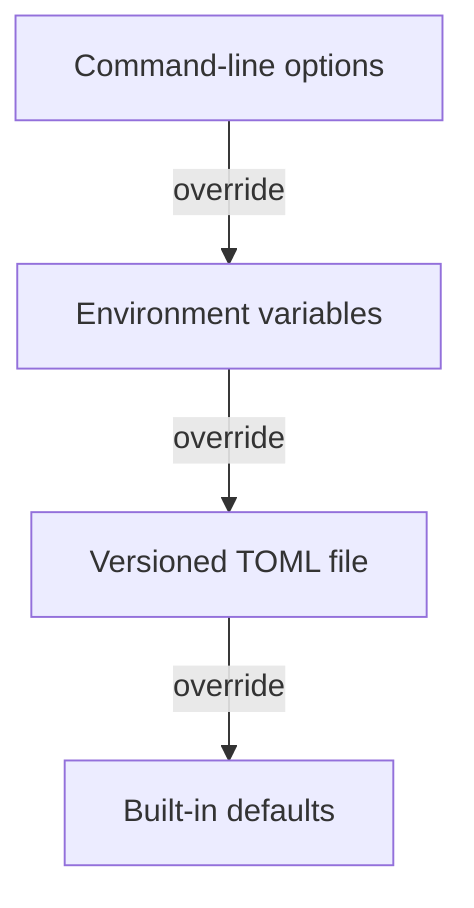

# Configuration

Excise resolves configuration from the highest-precedence source that supplies a value. It rejects unknown keys, unsupported versions, invalid ranges, invalid choices, and conflicting custom keys.



!!! tip "Start with the defaults"

    Configure only values that express a real preference or resource boundary. Omitted limits retain the adaptive budgets that leave capacity for the rest of the process and the user’s system.

## Choose a Configuration File

=== "Command line"

    ```console
    excise --config /path/to/config.toml /path/to/inspect
    ```

    An explicit `--config FILE` selects the file for that invocation.

=== "Environment"

    ```console
    EXCISE_CONFIG=/path/to/config.toml excise /path/to/inspect
    ```

    `EXCISE_CONFIG` selects the file when the command line does not.

=== "Platform default"

    Without either selector, Excise reads `config.toml` from the operating system’s standard per-user configuration directory when that file exists.

## TOML File

```toml
version = 1 # (1)!

[scanner]
threads = 8 # (2)!
event_buffer = 256
apparent_size = false
cross_filesystems = false
exclusions = [".git/", "target/"]

[model]
process_memory_mib = 512
temporary_storage_mib = 4096
# Omit these optional limits to use the adaptive scratch-space budget.
# scan_store_mib = 8192 # (3)!
# scan_store_reserve_mib = 4096
scan_store_dir = "/var/tmp/excise" # (4)!

[runtime]
reduced_motion = false
theme = "excise-dark"
ascii = false
mouse = false
keymap = "vim"
format = "tui"
```

1. `version = 1` is required. Unsupported versions are rejected rather than silently reinterpreted.
2. A configured worker count must be between one and 32. By default, Excise uses all but one detected processor, bounded to one through eight workers.
3. `scan_store_mib` and `scan_store_reserve_mib` are optional limits. Omit them to retain the adaptive scan-store budget.
4. `scan_store_dir` names the parent directory for private, automatically cleaned per-session scan data. It must be writable.

### Custom Movement Keys

Custom movement requires four different, unmodified printable ASCII keys. They cannot replace normal commands.

```toml
[runtime]
keymap = "custom"

[runtime.custom_keys]
left = "a"
down = "s"
up = "w"
right = "d"
```

`runtime.output` works only when `runtime.format` is `table` or `json`.

## Fields

| Field | Meaning | Valid values |
|---|---|---|
| `scanner.threads` | Number of scanner workers | 1 through 32 |
| `scanner.event_buffer` | Capacity of the worker event queue | 16 through 4096 |
| `scanner.apparent_size` | Prefer logical length in the interface | true or false |
| `scanner.cross_filesystems` | Traverse beyond the starting file system | true or false |
| `scanner.exclusions` | Ordered gitignore-style patterns | An array of strings |
| `model.process_memory_mib` | Whole-process memory limit | At least 128 MiB and no more than detected memory |
| `model.temporary_storage_mib` | Directory-plan and deletion-result storage per session | At least 2 MiB |
| `model.scan_store_mib` | Optional upper limit for private scan data and page indexes | At least 2 MiB, capped by safe free space on its scratch volume |
| `model.scan_store_reserve_mib` | Scratch space kept outside scan-store files | At least 0 MiB; defaults to 25 percent of free scratch space |
| `model.scan_store_dir` | Parent directory for private scan-storage session data | A writable path |
| `runtime.reduced_motion` | Disable nonessential transitions | true or false |
| `runtime.theme` | Built-in color theme | See `excise --help` for names |
| `runtime.ascii` | Use ASCII symbols and borders | true or false |
| `runtime.mouse` | Enable mouse selection | true or false |
| `runtime.keymap` | Movement preset | `vim`, `emacs`, or `custom` |
| `runtime.format` | Output mode | `tui`, `table`, or `json` |
| `runtime.output` | Report destination for noninteractive output | A path |

???+ info "Memory and scratch-space budgets"

    The default process memory limit is 512 MiB or the detected available memory when that is lower. Excise reserves 25 percent as process headroom and limits working data to the remaining 75 percent.

    Temporary storage defaults to 4 GiB per session. The scan-store budget adapts to its scratch volume: it uses up to 75 percent of safe free space and reserves the remaining 25 percent for the user and other processes. `model.scan_store_mib`, `EXCISE_SCAN_STORE_MIB`, and `--scan-store-mib` set an optional upper limit. `model.scan_store_reserve_mib`, `EXCISE_SCAN_STORE_RESERVE_MIB`, and `--scan-store-reserve-mib` replace the default reserve.

    When the volume permits it, the effective budget still leaves the minimum usable scan-store capacity. The scan-store directory contains durable scan data and completed page indexes only for the private active session.

The interactive ++t++ picker previews existing `runtime.theme` values without changing configuration. Press ++enter++ to save the selected theme for later TUI sessions, or ++esc++ to restore the original value without writing a preference.

## Environment Variables

| Variable | Corresponding setting |
|---|---|
| `EXCISE_CONFIG` | Explicit configuration file |
| `EXCISE_ROOT` | Scan root |
| `EXCISE_SCAN_THREADS` | `scanner.threads` |
| `EXCISE_EVENT_BUFFER` | `scanner.event_buffer` |
| `EXCISE_APPARENT_SIZE` | `scanner.apparent_size` |
| `EXCISE_CROSS_FILESYSTEMS` | `scanner.cross_filesystems` |
| `EXCISE_EXCLUDE` | Exclusion patterns separated by semicolons |
| `EXCISE_MEMORY_MIB` | `model.process_memory_mib` |
| `EXCISE_TEMPORARY_STORAGE_MIB` | `model.temporary_storage_mib` |
| `EXCISE_SCAN_STORE_MIB` | `model.scan_store_mib` |
| `EXCISE_SCAN_STORE_RESERVE_MIB` | `model.scan_store_reserve_mib` |
| `EXCISE_SCAN_STORE_DIR` | `model.scan_store_dir` |
| `EXCISE_REDUCED_MOTION` | `runtime.reduced_motion` |
| `EXCISE_THEME` | `runtime.theme` |
| `EXCISE_ASCII` | `runtime.ascii` |
| `EXCISE_MOUSE` | `runtime.mouse` |
| `EXCISE_KEYMAP` | `runtime.keymap` |
| `EXCISE_FORMAT` | `runtime.format` |
| `EXCISE_OUTPUT` | `runtime.output` |
| `NO_COLOR` | Force monochrome rendering when present |

Boolean environment values accept `true`, `false`, `yes`, `no`, `on`, `off`, `1`, and `0`, without regard to letter case.

## Deletion Confirmation

!!! warning "Reduced confirmation is intentionally nonpersistent"

    `--disable-delete-confirmation` does not remove deletion safeguards. It enables a visible, session-only reduced confirmation mode. It is intentionally unavailable in both the persistent configuration file and the environment.
