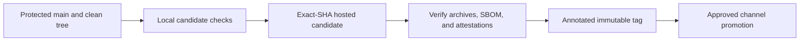

# Release Process

!!! warning "Release from an exact reviewed commit"

    The current stable package version is `1.3.0`. This runbook defines the v1 release procedure. Candidate generation is read-only; publication is a separate reviewed action. Dated approval records are historical evidence, not instructions for a new publication.



## Preconditions and Clean Tree

Only a maintainer may start publication. Before creating a tag, dispatching a candidate, or using a publication credential:

- [ ] Merge the focused release change to protected `main`. It updates the version and lockfile, moves user-visible `Unreleased` notes into a dated changelog entry, regenerates man pages and shell completions, and contains no unrelated source changes.
- [ ] Review deletion, accounting, schema, configuration, platform, compatibility, and release notes in the release PR.
- [ ] Check out the exact protected commit and require clean tracked, staged, and untracked release input.
- [ ] Confirm the commit, branch protection, and manifest version before hosted dispatch.
- [ ] Obtain release and environment approval before enabling any write credential.

```console
# This must report no release input outside the reviewed commit.
test -z "$(git status --porcelain=v1 --untracked-files=all)"
git diff --exit-code
git diff --cached --exit-code
```

Do not use `--allow-dirty`, copy generated files from another checkout, or mix outputs from different commits. Ignored build output does not make a dirty tracked tree safe; inspect unexpected ignored release input before continuing. Capture `source_sha="$(git rev-parse HEAD)"` from the exact protected commit and pass it to the workflow. The workflow rejects a moving ref, an unprotected ref, an unmerged commit, or a mismatched SHA.

## Local Candidate

```console
(
  set -euo pipefail
  cargo verify
  cargo package --locked --list
  cargo publish --locked --dry-run
  cargo dist-local
)
```

`cargo verify` includes generated-file, schema, distribution-template, compilation, test, policy, fuzz, benchmark, and release-binary checks. `cargo publish --locked --dry-run` packages the exact crate without uploading and must pass without `--allow-dirty`.

`cargo dist-local` builds the host release archive and supporting metadata without publishing. It writes the host archive under `dist/`, `dist/checksums.sha256`, and `dist/homebrew/excise.rb`. Inspect the archive before using hosted artifacts. It contains the release binary, `LICENSE`, `README.md`, generated man and completion files, schemas, `excise.cdx.json`, and `provenance.local.json`.

## Hosted Candidate

The manually dispatched `Release candidate artifacts` workflow in `.github/workflows/release.yml` checks out the explicit reviewed SHA and requires the input version and dispatch ID to match the package contract. Dispatch only from protected `main`; abort if `main` moves between capture and dispatch.

??? info "Dispatch and collect the exact-SHA candidate"

    ```console
    set -euo pipefail
    source_sha="$(git rev-parse HEAD)"
    version="$(sed -n 's/^version = "\([^\"]*\)"/\1/p' Cargo.toml | sed -n '1p')"
    test -n "$version"
    candidate_dir="$(mktemp -d "${TMPDIR:-/tmp}/excise-candidate.XXXXXX")"
    trap "$(printf 'rm -rf -- %q' "$candidate_dir")" EXIT
    dispatch_seed="$(date -u +%s)-$$-$RANDOM"
    if command -v sha256sum >/dev/null 2>&1; then
      dispatch_id="$(printf '%s' "$dispatch_seed" | sha256sum | cut -c1-32)"
    else
      dispatch_id="$(printf '%s' "$dispatch_seed" | shasum -a 256 | cut -c1-32)"
    fi
    run_url="$(gh workflow run release.yml --repo findyourexit/excise --ref main --field version="$version" --field source_sha="$source_sha" --field dispatch_id="$dispatch_id")"
    run_id="${run_url##*/}"
    if [[ ! "$run_id" =~ ^[0-9]+$ ]]; then
      run_id="$(
        candidate=""
        for attempt in 1 2 3 4 5; do
          if candidate="$(
            gh run list \
              --repo findyourexit/excise \
              --workflow release.yml \
              --event workflow_dispatch \
              --branch main \
              --commit "$source_sha" \
              --limit 20 \
              --json databaseId,headSha,headBranch,event,createdAt,displayTitle |
            jq -r --arg expected "$source_sha" --arg dispatch_id "$dispatch_id" '
              map(select(
                .headSha == $expected and
                .headBranch == "main" and
                .event == "workflow_dispatch" and
                .displayTitle == ("Excise release candidate " + $dispatch_id)
              ))
              | sort_by(.createdAt)
              | .[].databaseId
            '
          )"; then
            candidate_count="$(printf '%s\n' "$candidate" | sed '/^$/d' | wc -l | tr -d '[:space:]')"
            if [[ "$candidate_count" == "1" && "$candidate" =~ ^[0-9]+$ ]]; then
              printf '%s' "$candidate"
              break
            fi
            if (( candidate_count > 1 )); then
              echo "multiple workflow runs matched dispatch ID $dispatch_id" >&2
              exit 1
            fi
          fi
          sleep 2
        done
      )"
    fi
    if [[ ! "$run_id" =~ ^[0-9]+$ ]]; then
      echo "could not resolve the dispatched workflow run ID $dispatch_id: $run_url" >&2
      exit 1
    fi
    gh run watch "$run_id" --repo findyourexit/excise --exit-status
    gh run download "$run_id" --repo findyourexit/excise --name excise-release-candidate --dir "$candidate_dir"
    ```

The candidate contains six immutable target archives, `checksums.sha256`, and `excise.spdx.json`. Verify the complete bundle outside the source worktree:

```console
(
  set -euo pipefail
  cd "$candidate_dir"
  if command -v sha256sum >/dev/null 2>&1; then
    sha256sum --check checksums.sha256
  else
    shasum -a 256 --check checksums.sha256
  fi
  jq -e '.packages | length > 1' excise.spdx.json
  jq -e '.packages[] | select(.name == "serde")' excise.spdx.json
  jq -e --arg version "$version" '([.packages[] | select(.name == "excise" and .versionInfo == $version)] | length == 1)' excise.spdx.json
  for archive in excise-*.tar.gz; do tar -tzf "$archive" >/dev/null; done
  for archive in excise-*.zip; do unzip -t "$archive" >/dev/null; done
  for subject in excise-*.tar.gz excise-*.zip checksums.sha256 excise.spdx.json; do
    gh attestation verify "$subject" \
      --repo findyourexit/excise \
      --signer-workflow findyourexit/excise/.github/workflows/release.yml \
      --source-digest "$source_sha" \
      --source-ref refs/heads/main
  done
)
```

Confirm every archive contains its target binary, `LICENSE`, `generated/man/excise.1`, and `schemas/scan-report.schema.json`. The SBOM and provenance files are candidate-bundle evidence; never silently substitute them for an archive. Candidate artifacts are retained for one day, which is a validation convenience rather than durable distribution.

## Create the Annotated Release Tag

Only after every verification passes, create an annotated tag from the reviewed source checkout. The tag must point to the candidate’s exact source SHA and carry `candidate-run-id: $run_id` in its message.

```console
cargo create-release-tag "$version" "$source_sha" "$run_id"
git push origin "v$version"
```

!!! danger "Do not use `gh release create` for the tag"

    It creates a lightweight tag, which fails the release-validation gate before publication.

## Promotion Order and Publication Semantics

The `release` job creates the GitHub release from the promoted candidate bundle. It reuses an existing published release only after the exact tag object, complete asset set, and every asset checksum match. Published mismatches and unexpected drafts are refused; a matching non-prerelease draft may be repaired with reverified candidate assets.

The `publish-crate` job publishes exactly once after the release job succeeds. Do not run `cargo publish` manually. It accepts an existing version only after matching its registry checksum and non-yanked state; otherwise it fails before retrying.

After `homebrew-tap` environment approval, `publish-homebrew` renders and pushes only `Formula/excise.rb` from the verified source SHA. Review the resulting tap commit and formula afterward. Do not edit that external repository from this checkout.

The crates.io package follows the release commit’s Cargo exclusions: `.cargo`, `.github`, `.gitmessage`, `assets`, `tapes`, `handoff`, and `packaging`. `cargo package --locked --list` is the source of truth. The GitHub archive and tap do not become crate contents, and the `1.0.0` API boundary is command-line only; publishing is not a promise of a supported Rust library.

## Channel Verification

=== "Nix and cargo-binstall"

    With `version` set to the published manifest version, verify the tagged Nix flake and cargo-binstall archive independently:

    ```console
    nix flake check "github:findyourexit/excise/v${version}"
    nix eval --raw "github:findyourexit/excise/v${version}#packages.$(nix eval --raw --impure --expr builtins.currentSystem).default.version"
    nix run "github:findyourexit/excise/v${version}" -- --version
    nix run "github:findyourexit/excise/v${version}" -- --format table /path/to/inspect
    (
      set -euo pipefail
      binstall_dir="$(mktemp -d "${TMPDIR:-/tmp}/excise-binstall.XXXXXX")"
      readonly binstall_dir
      trap 'rm -rf -- "$binstall_dir"' EXIT
      cargo binstall --no-confirm --force --install-path "$binstall_dir" --version "$version" excise
      "$binstall_dir/excise" --version
    )
    ```

    `nix eval` and `nix run -- --version` verify the tagged package independently. The isolated cargo-binstall block verifies a fresh target-specific archive and invokes that exact binary. Do not treat one channel’s success as evidence for another.

=== "Homebrew tap"

    The first-party binary formula is installed from `findyourexit/homebrew-tap`, not Homebrew Core:

    ```console
    brew tap findyourexit/tap https://github.com/findyourexit/homebrew-tap.git
    brew install findyourexit/tap/excise
    brew fetch --force --retry findyourexit/tap/excise
    brew audit --formula --strict --online findyourexit/tap/excise
    brew test findyourexit/tap/excise
    brew info findyourexit/tap/excise
    excise --version
    ```

    `brew fetch` verifies the archive URL and SHA-256, `brew audit` checks formula policy, `brew test` runs version and JSON-scan smoke checks, and `brew info` confirms version and tap. Inspect `brew cat findyourexit/tap/excise` too. Every URL must be a `releases/download/v${version}/` asset and every checksum must match `checksums.sha256`. `packaging/homebrew-core/excise.rb.in` has different build semantics and is not evidence that Homebrew Core accepted Excise.

## Credentials and Approvals

| Credential or approval | Boundary |
|---|---|
| `CARGO_REGISTRY_TOKEN` or Cargo credential file | Authorizes `cargo publish`; use only for the approved command. Never print, commit, or put it in a tape or report. |
| `GH_TOKEN` | Authorizes local `gh` commands. An Actions `GITHUB_TOKEN` needs `contents: write` only in the approved promotion job. The read-only candidate job must not be broadened casually. |
| Homebrew-tap credential | Separately approved write access to `findyourexit/homebrew-tap`; repository access to Excise does not imply it. |

Do not run with shell tracing (`set -x`) around secrets. Before each write, review environment, repository selection, ref, SHA, version, and destination. If a required credential or approval is absent, stop before the write. Do not substitute a personal token or a different repository.

## Reruns and Rollback

Candidate generation is safe to rerun after a transient workflow failure, but reuse the same version and exact source SHA and revalidate the complete bundle. If source changes after a failed candidate, land the fix on protected `main`, dispatch a new candidate, and discard the old one. Never mix archives, checksums, SBOMs, or attestations from different SHAs. A missing one-day artifact is regenerated only through the same gated workflow.

Publication may be retried only after inspecting the GitHub tag, release, assets, crates.io `excise` version, and external tap commit. The release job safely reuses only a published release whose exact candidate asset set and checksums match. Continue only with the missing, reviewed step; never rebuild an already published asset or republish an existing crate version.

??? warning "Immutable publication recovery"

    If a workflow defect is fixed on protected `main` after the release tag already exists, do not move the tag. Dispatch the fixed workflow in immutable publication-recovery mode with the original source SHA, tag, and candidate run ID:

    ```console
    gh workflow run release.yml \
      --repo findyourexit/excise \
      --ref main \
      --field mode=publish-existing \
      --field version="$version" \
      --field source_sha="$source_sha" \
      --field dispatch_id="$recovery_id" \
      --field tag="v$version" \
      --field candidate_run_id="$run_id"
    ```

    The recovery gate verifies protected `main` did not move during dispatch, the immutable tag still targets `source_sha`, and `run_id` is the successful candidate for that exact source before reusing artifacts.

If a deletion-safety or release-integrity defect is found, stop promotion and mark the affected channel unavailable while preserving candidate evidence. Do not move, delete, or overwrite a tag or GitHub asset. A rollback cannot undo filesystem deletion and must not ask users to rerun a destructive command. After review, publish a new corrective version such as `1.3.1`, then update each channel to that immutable version. A crates.io yank only prevents new dependency resolution; it does not erase an already downloaded crate.

## Stable v1 Contract Decision Record

The `1.0.0` release is the first stable line and is authorized only after public behavior, support policy, safety evidence, and release procedure are explicit and reviewed. The `0.3.x` line remains historical early testing.

| Area | Required v1 decision | Current position |
|---|---|---|
| Command line | Freeze command names, options, defaults, help text, and noninteractive behavior. Additive changes are permitted; incompatible changes require a major version. | Existing command definitions and generated files are the candidate baseline. |
| Environment and configuration | Preserve command line, environment, versioned TOML file, and default precedence. Reject unknown or invalid values and every file version other than `1`. Do not silently migrate or reinterpret configuration. | `version = 1`, precedence, and rejection are implemented and tested. |
| Table output | Treat table output as human-facing and not stable for programs. Preserve safety and escaping; direct programs to JSON. | JSON is machine-readable; table layout is not stable. |
| JSON reports | Keep `scan-report`, `deletion-history`, and `native-path` versions stable. Add fields only when consumers can ignore them; increase the format version for incompatible changes. | JSON is machine-readable; table layout is not stable. |
| Exit classes | Preserve documented numeric classes and keep uncertain, partial, and interrupted results distinct from exact results. | Codes are implemented and tested. |
| Deletion | Preserve identity checks without following links, independent listing, repeated checks, root and summary rejection, explicit partial results, and permanent deletion. | The deletion contract and focused safety suite are the baseline. |
| Accounting | Preserve space counted once per identity, separate file length, conservative reclaimable bounds, and explicit unknowns. Do not claim exact physical shared-storage totals. | The accounting contract and fixtures are the baseline. |
| Rust interface | Treat the CLI, configuration, and versioned reports as the supported product. Rust implementation modules are private. | The private boundary is implemented; the crate exposes no supported Rust interface. |
| Platforms | Fully support only targets tested on the actual system; keep build-only targets clearly marked until runtime evidence exists. | Three targets are supported and three published archives remain best effort. |
| Distribution and governance | Require exact protected-commit artifacts, checksums, an SBOM, origin records, rollback, and explicit release authority. | Artifact identity and rollback are operational. `GOVERNANCE.md` names lead-maintainer authority and adds requirements when a second maintainer is appointed. |

Keep this record current through reviewed pull requests. Any implementation change affecting a row requires that row to be reviewed again before release authorization. The lead maintainer in `MAINTAINERS.md` owns final product, safety, and release decisions and may authorize publication only after this gate, protected-main ruleset checks, and publication-environment approval. When a second maintainer is appointed, the additional `GOVERNANCE.md` requirements apply.

A release candidate must record the exact source commit, candidate run, artifact checksums, SBOM, attestations, package-channel results, and reviewer decision against this table. A passing automated check is evidence only for its own scope; it is not approval for a different scope.

### Required Exit Evidence

Before the `v1.0.0` release PR could be approved, it needed:

1. A reviewed public-contract decision record covering every row above.
2. Upgrade and compatibility tests for command-line behavior and configuration, including rejection of unsupported versions, table safety and escaping, JSON formats, file paths, and exit classes. `tests/cli_contract_smoke.rs` exercises the binary-level portion.
3. Runtime evidence on every supported target, plus an explicit disposition for build-only targets.
4. Focused security reviews of deletion, file identity, temporary storage, terminal restoration, and release systems.
5. Dependency, unsafe-boundary, fuzz, benchmark, packaging, SBOM, checksum, and provenance evidence from the exact release commit.
6. A clean protected-commit release rehearsal and documented corrective-release procedure.

An empty list of user reports is not evidence that behavior is safe. Keep an early-testing warning until evidence exists, not merely until a version number changes.

## Historical Approval Records

??? note "0.1.1 contract — historical"

    The published `0.1.1` release was early testing. Its public library API and destructive behavior remained provisional until the project declared a stable line. Users were instructed to test only with disposable data and not use it with irreplaceable files.

    The release commit and candidate agreed on all of the following:

    - `Cargo.toml`, `Cargo.lock`, the command-line version, and the changelog identified `0.1.1`.
    - The crate was publishable; release metadata did not set `publish = false`.
    - The annotated `v0.1.1` tag pointed to the exact protected `main` commit that passed verification.
    - Six target archives, their SHA-256 manifest, the SPDX JSON SBOM, and GitHub build attestations described that same commit and version.
    - The first-party Homebrew tap formula referred only to those immutable GitHub release assets.
    - The tagged Nix flake and cargo-binstall metadata resolved the same immutable `0.1.1` release.

    The release did not enable Scoop, WinGet, Homebrew Core, or another package channel beyond the first-party Homebrew tap, tagged Nix flake, crates.io, and cargo-binstall metadata. Templates under `packaging/` are validation inputs unless a separately approved channel promotion says otherwise. `packaging/homebrew-core/excise.rb.in` is a possible future Homebrew Core submission, not the first-party tap formula.

??? note "0.1.2, 0.2.0, and 0.3.0 — historical"

    The corrective `0.1.2` release contains post-`0.1.1` accounting hardening and a fuzz-oracle fix. It is published but remains early testing; its public library API and destructive behavior were provisional. Its publication record is historical and immutable.

    `0.2.0` packaged the dense storage map, accessible terminal presentation, animation, overflow reporting, and retained accounting work in the changelog. It was a minor early-testing release because its public library API changed. The approved publication used source commit `f8329ce3ec5d338ee15459ec96a1f8897321b4ef`, candidate workflow [33045125756](https://github.com/findyourexit/excise/actions/runs/33045125756), immutable publication workflow [33045511141](https://github.com/findyourexit/excise/actions/runs/33045511141), annotated tag `v0.2.0`, native verification [33044958150](https://github.com/findyourexit/excise/actions/runs/33044958150), GitHub Release assets, crates.io, the first-party Homebrew Tap, cargo-binstall metadata, and the tagged Nix flake.

    `0.3.0` packaged the private Rust API boundary and compatibility-policy work in the changelog. It was a breaking minor early-testing release because provisional Rust module paths were removed. Its destructive behavior remained provisional. The active candidate, verification, and promotion procedure above applies to the stable v1 line.

??? note "Approved 1.0.0, 1.0.1, and 1.0.2 publications — historical"

    `1.0.0` froze CLI, configuration, versioned JSON reports, deletion and accounting semantics, support policy, and exact-commit distribution. Later incompatible changes require a major version; additive report and configuration changes must preserve documented compatibility rules.

    The approved `1.0.0` publication used source commit `b384a9ca6ac8d4853574083945d4a10d22b16817`, protected-main native verification [33117864079](https://github.com/findyourexit/excise/actions/runs/33117864079), exact-SHA candidate workflow [33118939870](https://github.com/findyourexit/excise/actions/runs/33118939870), annotated tag `v1.0.0` carrying `candidate-run-id: 33118939870`, immutable publication workflow [33119398710](https://github.com/findyourexit/excise/actions/runs/33119398710), GitHub Release [`v1.0.0`](https://github.com/findyourexit/excise/releases/tag/v1.0.0), and first-party Homebrew Tap formula commit [`9157017d736c23037e100ca6f13317f52c9c8683`](https://github.com/findyourexit/homebrew-tap/commit/9157017d736c23037e100ca6f13317f52c9c8683). The bundle contained six archives, `checksums.sha256`, and `excise.spdx.json`; checksums, SBOM, archive contents, all eight GitHub attestations, crates.io, cargo-binstall, Homebrew, and the tagged Nix flake each reported `1.0.0`. Support classifications are recorded in [SUPPORT.md](https://github.com/findyourexit/excise/blob/main/SUPPORT.md).

    `1.0.1` contained housekeeping documentation rewrites, DCO removal, and support-matrix fixes. Its approved publication used source commit `6dddc26c6f7f2c9cb75b5715d00f315d5ac91d5c`, native verification [33149660834](https://github.com/findyourexit/excise/actions/runs/33149660834), exact-SHA candidate [33151782132](https://github.com/findyourexit/excise/actions/runs/33151782132), annotated tag `v1.0.1` carrying `candidate-run-id: 33151782132`, immutable publication [33152146266](https://github.com/findyourexit/excise/actions/runs/33152146266), and GitHub Release [`v1.0.1`](https://github.com/findyourexit/excise/releases/tag/v1.0.1). Its bundle and eight attestations were independently verified; crates.io and Homebrew each reported `1.0.1`.

    `1.0.2` was a narrow correction after `1.0.1` that preserved the documented CLI, configuration, report, deletion, accounting, and support behavior. Its approved publication used source commit `10e0803f91e2bb2aaa8f8572fc24a0fba4c23ffd`, candidate run [33408059484](https://github.com/findyourexit/excise/actions/runs/33408059484), annotated tag `v1.0.2` carrying `candidate-run-id: 33408059484`, publication run [33408563018](https://github.com/findyourexit/excise/actions/runs/33408563018), and GitHub Release [`v1.0.2`](https://github.com/findyourexit/excise/releases/tag/v1.0.2). Checksums, archives, and SBOM data were verified; crates.io and the Homebrew tap were updated.

    The approved `0.1.1` publication used source commit `59eb0d17295eaef99305521651107c28dce27613`, candidate workflow [32733774029](https://github.com/findyourexit/excise/actions/runs/32733774029), annotated tag `v0.1.1` carrying `candidate-run-id: 32733774029`, and publication recovery run [32742153533](https://github.com/findyourexit/excise/actions/runs/32742153533). The tag was never moved; the recovery workflow verified and promoted exact candidate bytes without rebuilding them.

    The approved `0.1.2` publication used source commit `94987c5f48b781b6c035cb61931cf7aeb11eab0`, candidate workflow [32798065116](https://github.com/findyourexit/excise/actions/runs/32798065116), annotated tag `v0.1.2` carrying `candidate-run-id: 32798065116`, publication workflow [32798482623](https://github.com/findyourexit/excise/actions/runs/32798482623), and post-publication native verification [32800896471](https://github.com/findyourexit/excise/actions/runs/32800896471).

## Historical Tags

Tags `0.1.0` through `0.11.0` are preserved Diskonaut releases. They are not Excise releases and must not be moved, deleted, or reused. `v0.1.1` is a new Excise tag. Do not infer that preserved `0.1.0` identifies Excise merely because the changelog contains an Excise `0.1.0` section.
