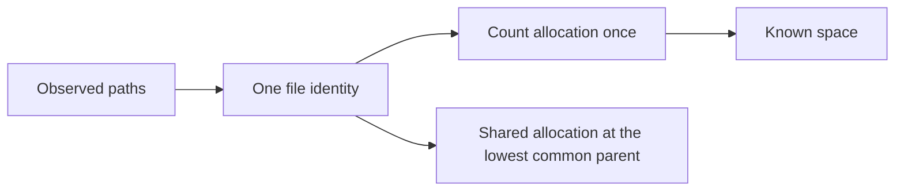

# Space Accounting Contract

!!! abstract "The primary measure"

    Excise reports **allocated space counted once for each file identity**. File length remains separate, and an unknown allocated value is never replaced with file length.

## Measures and Terms

Allocated space
:   The primary measure. A regular file counts once even when it has more than one name. A symbolic link or reparse object counts when the platform provides its space.

File length
:   A separate logical-size measure. It never substitutes for unavailable allocated-space data.

Directory metadata
:   Excluded so behavior remains consistent across platforms.

`Shared`
:   A synthetic informational entry that holds allocation shared across several child folders at their lowest observed common parent. It is never a deletion target.

## Files With More Than One Name

Track each observed identity, its allocated space, its declared link count when available, and the paths that point to it.

- Count each identity once within the scan scope.
- Keep every path visible, but give later paths no additional unique space.
- Place allocations shared by several child folders under `Shared` at the lowest observed common parent.
- Keep `Shared` informational only; it cannot authorize deletion.

## Space That Deletion Can Reclaim

For every real folder, report:

| Value | Meaning |
|---|---|
| Known space | Allocation counted once per identity. |
| Reclaimable lower bound | Conservative space that deletion can reclaim. |
| Reclaimable upper bound | Present only when link observations make one possible. |
| Unknown space | Unknown bytes plus the count of unknown files or folders. |

A link that may exist outside the scan scope prevents an unjustified exact total.

## Unknown Data and Scope

!!! warning "Unknown is a first-class result"

    A failed space or metadata query contributes unknown space. An unreadable folder contributes an unknown number of descendants. Parent folders retain a lower bound and show the uncertainty.

User exclusions and one-filesystem boundaries define scan scope. Excise reports those boundaries separately rather than calling them read failures. Configured exclusions and foreign-filesystem boundaries remain visible as zero-byte records with a reason.

Excise-owned session and scanner paths are different: they are omitted before entering the working model or reports, and only exact active paths match. User files with similar names are scanned normally.

## Shared Physical Storage

Version 1.0 counts file identities rather than physical storage blocks. Copy-on-write files, clones, transparent filesystem deduplication, compression, and shared physical storage can therefore cause an overcount. Reports and support documentation disclose that limit.

## Memory and Temporary Storage

???+ info "Two independent bounded stores"

    Each session has a 4 GiB temporary-storage budget and an adaptive scan-store budget. The scan store holds private on-disk session data. By default, it uses 75 percent of free space on the volume hosting its session directory and leaves the other 25 percent available. Users can set an upper limit with `--scan-store-mib` or choose a different reserve with `--scan-store-reserve-mib`.

    The scan store holds the scanner journal, ScanStore runs, and page-index data used to publish a folder’s immediate contents. Temporary storage holds overflow directory deletion plans and results. Each budget grows only as its files are written. Page publication consumes raw fact runs one phase at a time and retains only its compact child-query run, avoiding an unbounded duplicate of the filesystem.

    If scanner journal work cannot reserve scan-store capacity, the scanner reports an actionable failure and does not call the partial scan exact. If page creation cannot reserve capacity after directory reduction, ScanStore keeps a deterministic `summary-only` result; it never labels the detailed map exact or deletion-ready. If a directory plan cannot reserve storage for every reviewed identity and result, it stops before confirmation and deletes nothing. If result storage fails after consent, Excise starts no further changes and reports work already completed.

## Map Invariants

| Invariant | Meaning |
|---|---|
| Additive children | Child areas add up to the parent’s represented known space. |
| Explicit sharing | `Shared` preserves allocation not attributable to one direct entry. |
| Explicit uncertainty | Unknown space stays outside any falsely exact area. |
| Finite geometry | Map geometry is finite, repeatable, in bounds, and non-overlapping. |
| Honest motion | Animation moves between valid old and new geometry without changing the numbers. |

## Required Fixtures

- [ ] Several names for one file in a directory.
- [ ] Names for one file split across sibling and deep folders.
- [ ] Names for one file outside the selected folder and outside scan scope.
- [ ] Sparse and compressed files.
- [ ] Missing allocated-space metadata.
- [ ] Inaccessible directories.
- [ ] Zero and maximum-size values.
- [ ] Scan-store capacity pressure and recovery.
- [ ] Platform-specific identity sources.
