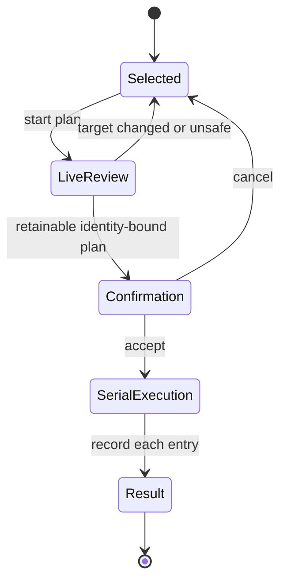

# Permanent Deletion Contract

!!! danger "No trash and no undo"

    Excise permanently removes confirmed file identities. It does not use a trash folder, quarantine area, or undo feature. Recursive deletion is not atomic.

On Linux and Apple platforms, Excise uses a temporary unpredictable name in the same parent directory while checking and removing one identity. Windows uses verified handles. Both paths avoid following links.

## Eligibility

A deletion plan can begin only when every condition holds:

- The selected entry is real, retained in the map, and is not the virtual `Shared` allocation summary.
- Its stored scan snapshot has a verified identity. The displayed page of direct children may still be incomplete.
- The entry is not the scan root, a filesystem, drive, or mount root.
- The platform has a reviewed method for deleting it without following links.

!!! info "Selection is not authorization"

    The display model selects a target only. The planner performs a separate live review without following links. Approximate hard-link accounting or a partial scan neither authorizes an unsafe deletion nor blocks a valid one.

## Plan Construction

1. Inspect the selected target from the live filesystem and bind identity, type, size, allocation, and modification state to the displayed snapshot.
2. For a directory, list current contents without following links. Record every relative path, identity, type, size, allocation, modification state, and required deletion order.
3. Keep directory-plan records in limited memory. Store overflow plans and results under the configured temporary-storage limit. Unix uses anonymous files; Windows creates a current-user-only exclusive file in the selected target’s parent, outside the target, and deletes it when its handle closes.
4. Authenticate every spilled record with a process-private key. Every decoded path must have safe components whose prefix is the selected target before later checks or execution.
5. Reserve memory and temporary storage for every planned identity and result before confirmation. If the complete plan or report cannot be retained, discard it before confirmation and delete nothing.
6. Recheck every planned entry immediately before deletion. Reject a directory plan that targets or contains a filesystem or mount root.
7. If planning before consent or the final whole-plan check finds a change, discard the plan and require a fresh user request. Prior consent is never reused.

## Confirmation

=== "Ordinary names"

    Files and safe printable directories accept ++enter++ or ++y++ in the confirmation dialog.

=== "Hostile or untypeable names"

    Excise shows an escaped full path and identity, then requires a generated challenge such as `DELETE K7M4`.

=== "Reduced confirmation mode"

    The visible session-only reduced mode accepts ++enter++ or ++y++ for all entries except hostile names. It is never saved. Root and Administrator accounts receive a visible warning; identity checks stay unchanged.

The planner runs in the background and retains at most four non-overlapping targets. When a plan is ready, its confirmation remains in the foreground. Accepted confirmation returns immediately to map navigation. A single executor then performs the final whole-plan check and filesystem changes in order. Every Unix entry is checked again after isolation and immediately before removal.

## Execution

For every planned entry, Excise:

1. Resolves it from the confirmed parent without following links.
2. Binds the operation to the confirmed file identity or Windows file handle.
3. Checks identity, type, size, allocation, and modification state against the review plan.
4. Deletes only when every relevant value still matches. Otherwise it restores the temporary name, records the exact result, and skips the entry.
5. Records success, changed identity, permission or sharing error, missing entry, recovery error, or another failure.
6. Finishes recovery for that entry before continuing with other entries that remain safe.

The working model changes only from confirmed deletion results.

## Interruption

| State at exit request | Safe choices |
|---|---|
| No work | Exit through the ordinary preference prompt. |
| Pending plans | Cancel the bounded pending set and quit, or return to the map and wait. |
| Active deletion | Stop only after the current entry finishes and record the bounded result, or return to the map and wait. |

!!! warning "No silent detach"

    No key silently detaches a mutation worker or claims that a blocked filesystem operation has stopped.

## Result

Normal completion and soft cancellation report every planned identity as deleted, changed, missing, failed, or unattempted through limited in-memory storage or authenticated temporary files. Session history has a fixed memory limit and writes directly to the versioned `deletion-history` format.

If result storage fails after consent, Excise starts no further entries, returns an explicit incomplete result, and schedules a root rescan instead of creating an unbounded report.

## Required Evidence

- [ ] File and directory replacement races.
- [ ] New-child races.
- [ ] Symbolic-link and Windows-junction behavior.
- [ ] Permission and sharing failures.
- [ ] Deterministic Windows sharing-violation behavior.
- [ ] Partial continuation when some entries cannot be deleted.
- [ ] Elevated and reduced-safeguard modes.
- [ ] Safe-stop and wait choices with terminal restoration.
- [ ] Tests of each supported platform deletion method.
- [ ] Randomized tests for deletion-plan construction.
