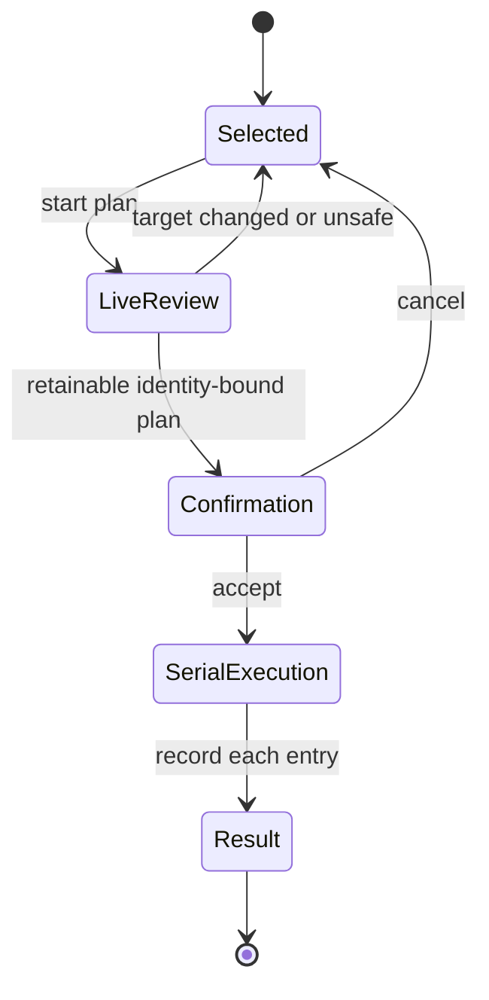

# Permanent Deletion Contract

!!! danger "No trash and no undo"

    Excise permanently removes confirmed file identities. It does not use a trash folder, quarantine area, or undo feature. Recursive deletion is not atomic.

```mermaid
stateDiagram-v2
    [*] --> Selected
    Selected --> LiveReview: start plan
    LiveReview --> Confirmation: retainable identity-bound plan
    LiveReview --> Selected: target changed or unsafe
    Confirmation --> SerialExecution: accept
    Confirmation --> Selected: cancel
    SerialExecution --> Result: record each entry
    Result --> [*]
```

On Linux and Apple platforms, Excise uses a temporary unpredictable name in the same parent directory while checking and removing one identity. Windows uses verified handles. Both paths avoid following links.

## Eligibility

A deletion plan can begin only when every condition holds:

- The selected entry is real, retained in the map, and is not the virtual `Shared` allocation summary.
- Its stored scan snapshot has a verified identity. The displayed page of direct children may still be incomplete.
- The entry is not the scan root, a filesystem, drive, or mount root.
- The platform has a reviewed method for deleting it without following links.

!!! info "Selection is not authorization"

    The display model selects a target only. The planner performs a separate live review without following links. Approximate hard-link accounting or a partial scan neither authorizes an unsafe deletion nor blocks a valid one.

## Plan Construction

1. Inspect the selected target from the live filesystem and bind identity, type, size, allocation, and modification state to the displayed snapshot.
2. For a directory, list current contents without following links. Record every relative path, identity, type, size, allocation, modification state, and required deletion order. On Unix every folder is reached, and every entry read, through the handle of the folder above it and the entry's own name, so no step names a whole path and how deep a folder sits does not limit a plan.
3. Keep directory-plan records in limited memory. Store overflow plans and results under the configured temporary-storage limit. Unix uses anonymous files; Windows creates a current-user-only exclusive file in the selected target’s parent, outside the target, and deletes it when its handle closes. The file is Excise’s own for as long as it exists: its exact path is registered before it is created and until it is gone, and a scan, or the check of the folder that held a removed target, leaves a registered path out without reading it.
4. Authenticate every spilled record with a process-private key. Every decoded path must have safe components whose prefix is the selected target before later checks or execution.
5. Reserve memory and temporary storage for every planned identity and result before confirmation. If the complete plan or report cannot be retained, discard it before confirmation and delete nothing.
6. Recheck every planned entry immediately before deletion. Reject a directory plan that targets or contains a filesystem or mount root.
7. If planning before consent or the final whole-plan check finds a change, discard the plan and require a fresh user request. Prior consent is never reused.

A directory plan is rejected when its target or any folder in it is the root of a mount. The rule does not depend on how long a path is: on Unix each folder is asked about from its parent's handle and its own name. On Linux the kernel reports the root of any mount, a bind mount of a folder of the same filesystem included. Where it cannot, the mount table answers, and a folder whose path the kernel cannot name is refused, never assumed to be safe. Elsewhere on Unix, a folder on a different device than its parent is a mount root. A link to a mount root is a link, and stays plannable. Windows still checks the path.

When planning refuses, the notice says why where Excise can tell: access denied, a temporary-storage or plan-memory limit, a path too long or invalid for the system, a mount point or filesystem root in the folder, or a value the filesystem reports that Excise cannot keep, such as a negative size. Anything else reads that the selected item could not be checked. Planning changes nothing, so a refusal leaves everything as it was.

## Confirmation

=== "Ordinary names"

    Files and safe printable directories accept ++enter++ or ++y++ in the confirmation dialog.

=== "Hostile or untypeable names"

    Excise shows an escaped full path and identity, then requires a generated challenge such as `DELETE K7M4`.

=== "Reduced confirmation mode"

    The visible session-only reduced mode accepts ++enter++ or ++y++ for all entries except hostile names. It is never saved. Root and Administrator accounts receive a visible warning; identity checks stay unchanged.

The planner runs in the background and retains at most four non-overlapping targets. When a plan is ready, its confirmation remains in the foreground. Accepted confirmation returns immediately to map navigation. A single executor then performs the final whole-plan check and filesystem changes in order. Every Unix entry is checked again after isolation and immediately before removal.

## Execution

For every planned entry, Excise:

1. Resolves it from the confirmed parent without following links.
2. Binds the operation to the confirmed file identity or Windows file handle.
3. Checks identity, type, size, allocation, and modification state against the review plan.
4. Deletes only when every relevant value still matches. Otherwise it restores the temporary name, records the exact result, and skips the entry.
5. Records success, changed identity, permission or sharing error, missing entry, recovery error, or another failure.
6. Finishes recovery for that entry before continuing with other entries that remain safe.

For a file or link, Excise also counts the links its removal leaves, so that a hard link another process made at any moment, even after the review, is counted. The count decides whether the map can be updated in place or is scanned again, never whether a deletion is safe. On Linux Excise holds a reference to the object across its removal and reads the object's link count through it once its own name is gone; the reference is `O_PATH`, which touches nothing, for any kind of entry. On Windows the count is read through the handle that removed the file. macOS has no such flag, and Excise opens nothing it removes there: a plain open can block on an entry that another process has swapped for a FIFO, can make the system fetch a file whose content is elsewhere, and cannot open a socket at all. It names the object by its identity instead. The system resolves `/.vol/<device>/<inode>` to an object for as long as the object has a link, and answers that nothing is there once the last link is gone. A lookup there is a `stat`, which opens and fetches nothing, whatever kind of entry it names. The system also answers that nothing is there when it cannot resolve an identity at all, so Excise makes the reference only when the same lookup finds the object it inspected before the removal, and an entry it cannot reference counts as possibly linked. The lookup after the removal is as reliable as the system's resolution of the identity: a failure of it in the instant after the removal would read as proof only if another process had also linked the file in that instant, and Excise makes a reference only for a file with one link. On every system a file or link counts as possibly linked unless Excise read a count of zero after its removal, whatever became of the entry afterwards: a removal can be followed by a failure (the cleanup of the placeholder that held the entry's name), and an entry that failed, changed, or was already gone when Excise reached it can have been taken out by another process.

If the system refuses the rename that moves an entry aside, Excise records that entry as failed, with the system's reason, and goes on with the others, as it does for any other failure. It never removes an entry it could not move aside. Excise moves an entry aside by exchanging its name with a placeholder's, and names the placeholder, which is always a file, as the source of the exchange. That matters at depth: macOS 14 refuses, with "No space left on device", any rename whose source is a folder whose path is longer than the system's path length limit (1,024 bytes), an exchange included, and accepts one whose source is a file at any depth. An exchange swaps both names whichever is named first, so a folder that deep is moved aside, and removed, there too. A system that still refuses the rename for an entry whose path is longer than the limit (1,024 bytes on macOS, 4,096 on Linux) ends the run instead, because the folders above such an entry cannot be removed either, and stopping leaves the rest of the target as it was. The refused entry is recorded as failed, every later entry as unattempted, and the run is not recorded as cancelled.

The working model changes only from confirmed deletion results.

## Interruption

| State at exit request | Safe choices |
|---|---|
| No work | Exit through the ordinary preference prompt. |
| Pending plans | Cancel the bounded pending set and quit, or return to the map and wait. |
| Active deletion | Stop only after the current entry finishes and record the bounded result, or return to the map and wait. |

!!! warning "No silent detach"

    No key silently detaches a mutation worker or claims that a blocked filesystem operation has stopped.

## Result

Normal completion and soft cancellation report every planned identity as deleted, changed, missing, failed, or unattempted through limited in-memory storage or authenticated temporary files. Session history has a fixed memory limit and writes directly to the versioned `deletion-history` format.

If result storage fails after consent, Excise starts no further entries, returns an explicit incomplete result, and schedules a root rescan instead of creating an unbounded report.

## Required Evidence

- [ ] File and directory replacement races.
- [ ] New-child races.
- [ ] Symbolic-link and Windows-junction behavior.
- [ ] Permission and sharing failures.
- [ ] Deterministic Windows sharing-violation behavior.
- [ ] Partial continuation when some entries cannot be deleted.
- [ ] Elevated and reduced-safeguard modes.
- [ ] Safe-stop and wait choices with terminal restoration.
- [ ] Tests of each supported platform deletion method.
- [ ] Randomized tests for deletion-plan construction.

Two fuzz targets supply part of this evidence. `deletion_plan` builds and executes plans for generated trees. `deletion_lifecycle` drives the whole runtime (navigation, filter, delete, confirm, cancel, quit, resize) while it changes the live tree between a plan's review and its final check, and fails if an identity that no confirmed deletion reviewed disappears, if anything outside a confirmed target changes, or if the interface or the terminal is not restored afterwards. See [Fuzzing](../development.md#fuzzing).
